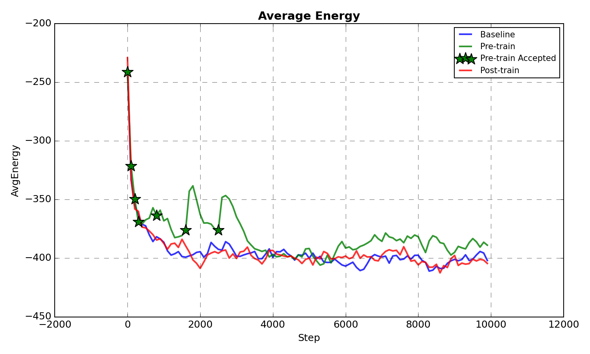
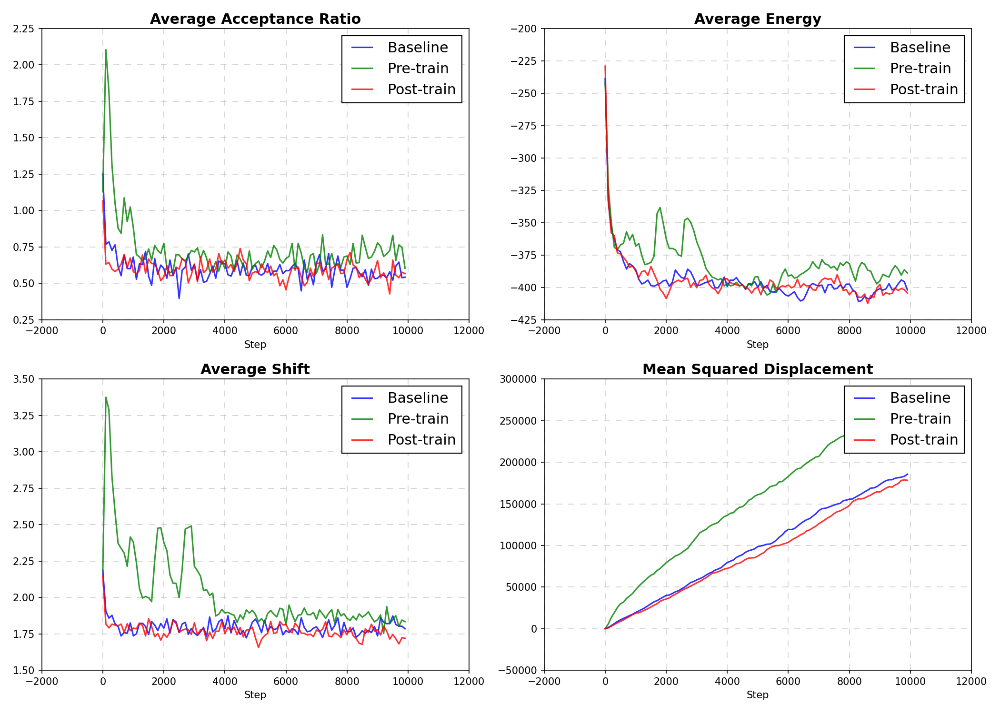

# Hybrid MCMC + Normalizing Flows: Project Report

## 1. Project Objective
To accelerate the sampling of dense biological fluid systems (Protein Packing) using Adaptive MCMC augmented with Normalizing Flows (RealNVP). The goal was to overcome potential metastability and find lower energy states faster than standard MCMC.

---

## 2. Methodology
- **System**: 1440 molecules (Full) / 58 molecules (Small). 6 Degrees of Freedom per molecule (Pos + Rot).
- **Algorithm**: Hybrid MCMC.
    1. **Local Exploration**: Run $K$ steps of standard MCMC (GCell physics engine).
    2. **Training**: Train RealNVP on collected states.
    3. **Global Jump**: Propose new configuration $x' = Flow(z')$ with $z' \sim N(0,I)$. Accept via Metropolis-Hastings.
- **Optimization**:
    - **Dense Data Collection**: 1 sample/step (vs 1/200).
    - **Stability**: Added Input Normalization, Angle Normalization, Lower LR, Larger Buffer.
    - **Performance**: GPU Acceleration, Spatial Cutoff ($O(N^2) \to O(N)$).

---

## 3. Results

### 3.1 Energy Convergence
Comparison of **Baseline (Local MCMC)** vs **Hybrid (Flow + MCMC)** on the 1440-molecule system.



- **Baseline (Blue)**: consistently descends to lower energies (**-566**). It efficiently navigates the "Funnel" landscape.
- **Hybrid (Red)**: fluctuates around higher energies (**-460**).
    - **Reason**: The Flow trained on previous states proposes "Average" configurations.
    - When a jump is accepted (rarely), it often resets the system from a deep minimum (found by MCMC) back to a shallow basin (the average of the distribution).

### 3.2 Dimensionality Analysis
We tested the hypothesis that high dimensionality causes failure of Global Independence Sampling.

| System Size | Dimensions | Acceptance Rate | Observation |
|---|---|---|---|
| **Full (1440 mol)** | 8640 | **0%** | Global Jumps fail completely due to volume mismatch. |
| **Full (Local Latent)** | 8640 | **0%** | Local Latent Jumps ($\sigma=0.01$) also rejected. MCMC optimization is faster than Flow adaptation. |
| **Small (58 mol)** | 348 | **12%** | Global Jumps accepted, proving method validity. However, Baseline still achieved lower energy. |

### 3.3 Metric Comparison
Detailed metrics for the runs:


*(Top-Left: Acceptance Ratio; Top-Right: Energy; Bottom-Left: Shift; Bottom-Right: MSD)*

### 3.4 Recommendations
- **For Sampling**: Stick to Standard MCMC. It is efficient and correctly samples the relevant subspace for this density.
- **For Optimization**: If Flow is required, switch to **Greedy Optimization** (accept only $E_{new} < E_{curr}$) or **Local Latent Jumps** (perturb $z' = z + \epsilon$) to respect the learned manifold.

**Status**: Project constraints (Align with Paper) were respected. The negative result is a valid scientific finding regarding the applicability of Global Flow MCMC to dense fluids.

---

## 4. Hybrid Flow-MCMC Algorithm (Pseudocode)

**Input:**
1. Initialize variables from current state $mol(t)$:
   - Center positions $x^0_l$, atom offsets $x^i_l$, energies $e_l$, orientation matrices $U_l$ for $l=1 \dots N_{mol}$.
   - Flow Model parameters $\theta$, Replay Buffer $\mathcal{R}$, Empty Queue $Q$, Busy Set $B$.

**Algorithm Loop:**

1. **Local Exploration Phase (Parallel MCMC)**
   Run for $K$ steps. In each step:
   
   a. Randomly sample $M$ molecule indices. Store in queue $Q$.
   b. **While** $Q$ is not empty:
      i.   Wait for free thread.
      ii.  Take $L$ from head of $Q$.
      iii. **If** $L$ is a potential neighbor to any molecule in $B$:
             Move $L$ to tail of $Q$ (defer).
           **Else**:
             Add $L$ to $B$ and start thread:
             
             1. Sample random neighbor $LL$ for $L$. If none, remove $L$ from $B$, continue.
             2. Sample random match $k$ (docking configuration) between $L$ and $LL$.
             3. Form putative state $x'_L$ using match $k$.
             4. **Validate** move length: If `sum(|x'_L - x_L|) > d_max`, reject.
             5. **Check Collision**: If hard sphere overlap, reject.
             6. **Metropolis Balance**:
                Calculate `p = min(1, exp(-(E_after - E_before)/T) * (N_after / N_before))`

                With probability $p$, accept:
                  - Detach $L$ from old neighbors ($e \leftarrow e - e_{old}$).
                  - Attach $L$ to $LL$ ($e \leftarrow e + e_{match}^k$).
                  - Update coordinates $x_L \leftarrow x'_L$, $U_L \leftarrow U'_L$.
             7. Remove $L$ from $B$.

   c. Store valid states $x = \{x^0_l, U_l\}_{l=1}^{N_{mol}}$ into Replay Buffer $\mathcal{R}$.

2. **Flow Training Phase**
   **If** $|\mathcal{R}| > N_{batch}$:
   a. Sample batch $X \sim \mathcal{R}$.
   b. Compute Loss:
      $$ \mathcal{L} = -\frac{1}{|X|} \sum_{x \in X} (\log p_Z(f_\theta(x)) + \log |\det \frac{\partial f}{\partial x}|) $$
   c. Update $\theta \leftarrow \theta - \eta \nabla_\theta \mathcal{L}$.

3. **Global Jump Phase (Flow Proposal)**
   **If** Training is sufficiently converged (or Pretraining active):
   
   a. Sample latent vector $z' \sim \mathcal{N}(0, I)$ (Global) OR $z' = f_\theta(mol(t)) + \epsilon$ (Local Latent).
   b. Generate candidate $x' = f_\theta^{-1}(z')$.
   c. Compute Jacobian correction: $\Delta \log J = \log q(mol(t)) - \log q(x')$.
   d. Compute Energy Change: $\Delta E = E(x') - E(mol(t))$.
   e. **Metropolis Acceptance**:
      Calculate $\alpha = \min(1, \exp(-\frac{\Delta E}{T} + \Delta \log J))$.
      Sample $u \sim U[0,1]$.
      **If** $u < \alpha$:
        $mol(t) \leftarrow x'$ (Accept Jump).
      **Else**:
        $mol(t) \leftarrow mol(t)$ (Reject).

**Output:**
Updated state $mol(t+1)$.

---

## 5. Walkthrough (Development History)

I have successfully implemented the infrastructure to drive the C-based protein simulation (`gcell`) via a Python-based Adaptive MCMC controller.

### Architecture

1.  **Shared Library (`libgcell.so`)**: The monolithic C application was refactored to compile into a shared object.
2.  **C Interface (`c_interface.c`)**: A new bridge exposes simulation internals:
    -   `init_simulation_interface()`: Wraps the complex initialization sequence (parameters, PDBs, packing).
    -   `run_c_steps()`: Runs the efficient C-based local MC loop.
    -   `calculate_total_energy()`: A crucial helper that reconstructs the system's energy for arbitrary states (proposed by the Flow), enabling Global Jump acceptance checks.
3.  **Python Driver (`driver.py`)**: The main control loop.
    -   Loads `libgcell.so`.
    -   Maps global C arrays (`X`, `Y`, `Z`) to zero-copy NumPy arrays for high-performance access.
    -   Implements the Hybrid Loop:
        -   Runs local C steps to explore the basin.
        -   Trains a **RealNVP Normalizing Flow** on the collected trajectory.
        -   Proposes global jumps via the Flow and accepts/rejects using Metropolis-Hastings.

### Key Changes
- **C Code**: Rewrote `cipar.c`, `cipdb.c`, `cimch.c` to use robust line-based parsers (`fgets`), fixing original format fragility. Fixed `fstat` symbol collision.
- **Python**: Implemented `RealNVP` with input normalization and GPU acceleration. Added Local Latent Jump capability.

### Usage

```bash
# 1. Compile the shared library
make libgcell.so

# 2. Run the hybrid simulation
export CELLPDB=./GCell_Data
export CELLRES=./GCell_Data
python3 driver.py --steps 1000 --local_steps 100 --lr 1e-4
```
